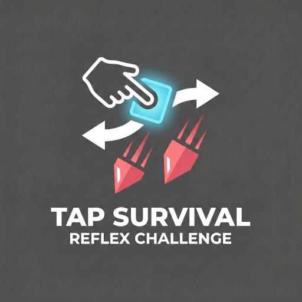

# Tab-Survival-Android-Game
**Tap Survival** is a minimalist, fast-paced top-down endless runner built for Android. Navigate through lanes, dodge increasingly difficult obstacles, and collect gems to unlock a vast array of customizations.



## ✨ Features

- **Dynamic Gameplay**: Difficulty scales in real-time as your score increases, with obstacle speeds and spawn rates adjusting dynamically.
- **Material 3 Design**: A premium UI experience utilizing the latest Material Design 3 color palettes and rounded aesthetics.
- **Power-up System**:
  - 🛡️ **Shield**: Survive a single crash.
  - 🧲 **Magnet**: Attract stars and gems from a distance.
  - 👻 **Ghost Mode**: Become temporarily invulnerable.
  - 🔥 **Fever Mode**: Triggered by collecting stars; turns all obstacles into rewards!
- **Deep Customization**:
  - **Actors**: Unlock various player icons including shapes and emojis (Alien, Robot, Rocket, etc.).
  - **Obstacle Shop**: Customize the look of your enemies with different shapes (Heart, Hexagon, Diamond) and colors.
  - **Skins**: Change the entire game environment (Neon City, Digital Rain, Deep Sunset).
- **Advanced Mechanics**: Includes screen-shake effects, danger vignettes when obstacles are close, and a combo system for high scores.
- **Leveling System**: Progress through levels to unlock new items and challenges.

## 🛠️ Tech Stack

- **Platform**: Android
- **Language**: Java / Kotlin
- **UI Framework**: Native Android (SurfaceView)
- **Design System**: Material Design 3 (M3)
- **Build System**: Gradle (Kotlin DSL)

## 🚀 Getting Started

### Prerequisites
- Android Studio Ladybug (or newer)
- Android SDK 35
- Minimum API Level: 24 (Android 7.0)

### Installation
1. Clone the repository:
   ```bash
   git clone https://github.com/your-username/tap-survival.git
